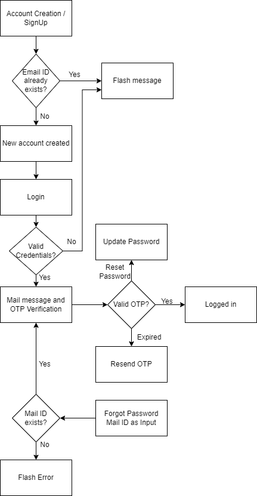

# OTP Verfication Application
This project implements a simple OTP Verification via email messages. A new user can start with creating an account. Whenever user tries to login, OTP verification is done as a second factor authentication. The OTP is sent via mail to the user registered email id using python smtplib library. OTP will be expired in 5 minutes. Javascript is used to disable the form submission after 5 minutes. If user forgets password, forgot password option can be used to reset password. OTP verification is done before resetting the password.
## Flow Diagram
The following diagram briefly shows the flow of the system
